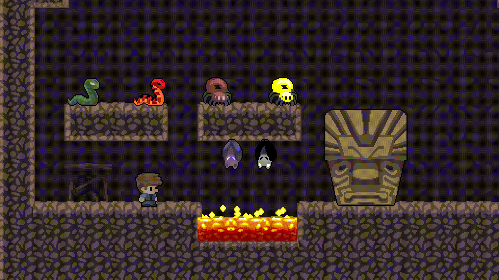

# Super Cave Boy Game

## About
Created with reference to [Benjamin Anderson's](https://www.youtube.com/user/uheartbeast) course, with new enemies added for improved difficulty.

## Installation Guide
* Create a folder for the game.
* Download SuperCaveBoy.exe and data.win.
* Move the files into the previously created folder.
* Double click on the SuperCaveBoy.exe file to start the game.

## How To Play
* Movement - W,A,S,D
* Cliff Hook - Jump to the edge of a cliff to hang onto it
* Killing basic enemies - Jump on it
* Killing the Boss - Make it drop into the lava
